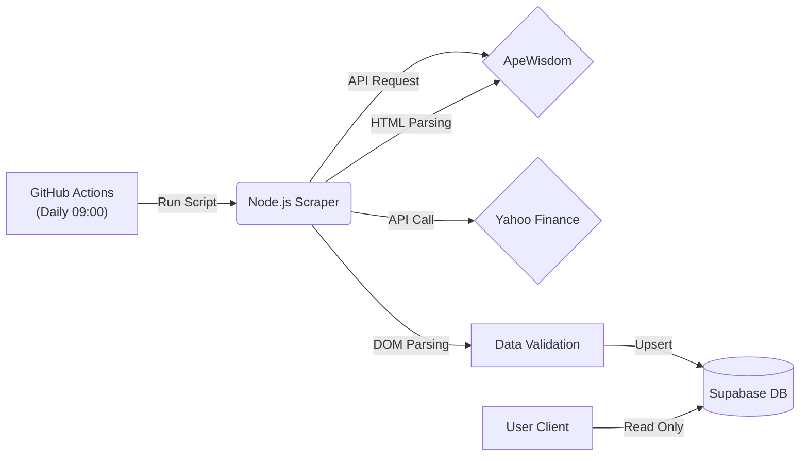

# 📈 DailyTicker: Automated Stock Insight Dashboard

<div align="center">
  
  
  
  
  
</div>

<br />

**DailyTicker**는 매일 아침 주목해야 할 주식 트렌드, 뉴스, 시장 심리를 한눈에 파악할 수 있는 **자동화된 주식 정보 대시보드**입니다.

단순한 데이터 조회를 넘어, 불규칙한 웹 데이터(HTML)를 정밀하게 파싱하여 정형 데이터로 변환하고, GitHub Actions를 통해 서버리스로 스스로 최신 상태를 유지하는 파이프라인을 구축하는 데 집중했습니다.

---

## 🔍 프로젝트 배경

주식 시장의 흐름을 읽기 위해서는 Yahoo Finance(주가), ApeWisdom(커뮤니티 여론), Tradingview(차트), 뉴스 사이트 등 여러 플랫폼을 오가야 하는 번거로움이 있었습니다.

저는 이 과정을 자동화하여:
1.  매일 정해진 시간(09:00 KST)에 스스로 데이터를 수집하고,
2.  웹사이트 구조 변경으로 인한 데이터 오염을 방어하는 파싱 로직을 적용하며,
3.  사용자에게는 직관적인 UI로 시각화해주는 서비스를 기획하게 되었습니다.

---

## 🎯 프로젝트 목표 및 달성

- **Serverless Automation**: 별도의 백엔드 서버 호스팅 비용 없이 GitHub Actions만으로 안정적인 크롤링 스케줄러 구현
- **Data Integrity via Parsing Strategy**: HTML 구조의 모호함으로 발생하는 데이터 오류를 DOM Selector 구체화로 해결
- **Separation of Concerns**: 데이터 수집 계층(Script)과 프레젠테이션 계층(React App)을 물리적으로 분리하여 유지보수성 향상

---

## 🔗 Live Demo

- **Service URL**: https://daily-ticker-iota.vercel.app/
- **Repository**: https://github.com/ByeongGwanKang/DailyTicker

---

## 🛠️ 기술 스택 (Tech Stack)

| Category | Technology | Description |
| :--- | :--- | :--- |
| **Frontend** | React, Vite | SPA 기반의 빠른 렌더링 및 사용자 경험 제공 |
| | TypeScript | 정적 타입 지정을 통한 런타임 에러 방지 (DailyTickerState 등) |
| | Tailwind CSS | 유틸리티 퍼스트 방식의 신속한 UI 스타일링 |
| **Backend** | Supabase | PostgreSQL 기반의 관리형 DB 및 데이터 영속성 보장 |
| **Pipeline** | GitHub Actions | Cron Job을 이용한 주기적 스크립트 실행 환경 |
| | Node.js & Cheerio | 가볍고 빠른 HTML 파싱 및 데이터 가공 스크립트 |
| **Deployment** | Vercel | 프론트엔드 자동 배포 및 CI/CD 파이프라인 연동 |

---

## 🏗️ 시스템 아키텍처 & 데이터 파이프라인

이 프로젝트는 수집(Collect) - 검증(Validate) - 시각화(Visualize)의 3단계 파이프라인으로 구성되어 있습니다.


# How It Works

1. **Trigger**: GitHub Actions가 매일 아침 스크립트를 실행합니다.

2. **Collect**: ApeWisdom HTML에서 트렌딩 지표를 추출하고, Yahoo Finance API로 실시간 주가를 보강합니다.

3. **Validate**: 불안정한 HTML 텍스트 데이터를 정제하여 수치 데이터(Number)로 변환합니다.

4. **Visualize**: 프론트엔드는 오직 DB의 데이터만을 조회하여 렌더링함으로써 성능을 최적화했습니다.

## 💡 문제 해결 (Troubleshooting)

### 1️⃣ HTML 구조적 한계로 인한 데이터 오염 해결

- **문제 상황**: 크롤링 대상 사이트의 DOM 구조상, '절대적인 수치(Value)'와 '변동률(Percentage)'이 명확한 구분 없이 하나의 부모 요소 안에 텍스트로 혼재되어 있었습니다. 이로 인해 상위 요소의 텍스트를 일괄 추출할 경우, 두 데이터가 공백 없이 결합되어 실제 값과 전혀 다른 비정상적인 수치로 인식되는 데이터 오류가 발생했습니다.

- **해결 방안**: 정밀한 DOM Selector 적용 단순 텍스트 추출 방식의 한계를 인지하고, HTML 구조에 기반한 정밀 타겟팅 전략을 수립했습니다.

  - **Before**: 상위 요소 일괄 추출 (.text()) → 데이터 혼입 발생

  - **After**: 자식 요소 중 변동률 데이터가 담긴 특정 태그(span)만 명시적으로 타겟팅 (.find('span').text())

  - **Result**: 부모 노드의 불필요한 텍스트를 배제하고 원하는 데이터만 정확히 추출하여 데이터 무결성을 확보했습니다.

### 2️⃣ Node.js 버전 호환성 이슈

- **문제 상황**: GitHub Actions의 기본 런타임(Node 18) 환경에서 최신 라이브러리(undici, supabase-js)가 요구하는 일부 내장 객체(File 등)를 지원하지 않아 스크립트 실행이 중단되는 현상이 발생했습니다.

- **해결 방안**: CI/CD 파이프라인 설정(.yml)에서 실행 환경을 Node.js 20으로 명시적으로 업그레이드하여 최신 런타임 호환성을 확보하고 안정적인 실행 환경을 구축했습니다.

## 📂 폴더 구조 (Project Structure)

```
DailyTicker/
├── .github/workflows/
│   └── daily-scrape.yml    # GitHub Actions 자동화 설정 (Cron Job)
├── scripts/
│   └── scrape.js           # 데이터 수집/파싱 및 Supabase 적재 로직
├── src/
│   ├── components/         # UI 컴포넌트 (NewsList, StockChart, CommunityStats 등)
│   ├── services/           # Supabase 클라이언트 및 환경변수 설정
│   ├── types.ts            # 데이터 인터페이스 정의 (TypeScript)
│   ├── App.tsx             # 메인 애플리케이션 로직
│   └── main.tsx            # Entry Point
├── package.json            # 의존성 관리
└── vite.config.ts          # Vite 번들러 설정
```

## 🚀 시작하기 (Getting Started)

이 프로젝트를 로컬 환경에서 실행하려면 다음 단계가 필요합니다.

### Prerequisites

- Node.js 20.0.0 이상

- Supabase 계정 및 프로젝트 생성

### Installation

1. Clone the repository

   ```
   git clone https://github.com/ByeongGwanKang/DailyTicker.git
   cd DailyTicker
   ```

2. Install dependencies

   ```
   npm install
   ```

3. Environment Setup (.env) 프로젝트 루트에 .env 파일을 생성하고 아래 변수를 설정합니다.

   ```
   # Frontend (Vite)
   VITE_SUPABASE_URL=your_supabase_project_url
   VITE_SUPABASE_KEY=your_supabase_anon_key

   # Backend Script (Node.js)
   SUPABASE_URL=your_supabase_project_url
   SUPABASE_KEY=your_supabase_service_role_key
   ```

4. Run Locally

   ```
   npm run dev
   ```

5. Run Scraper Manually

   ```
   node scripts/scrape.js
   ```

<div align="center">
  <p>Developed by Byeonggwan Kang</p>
</div>